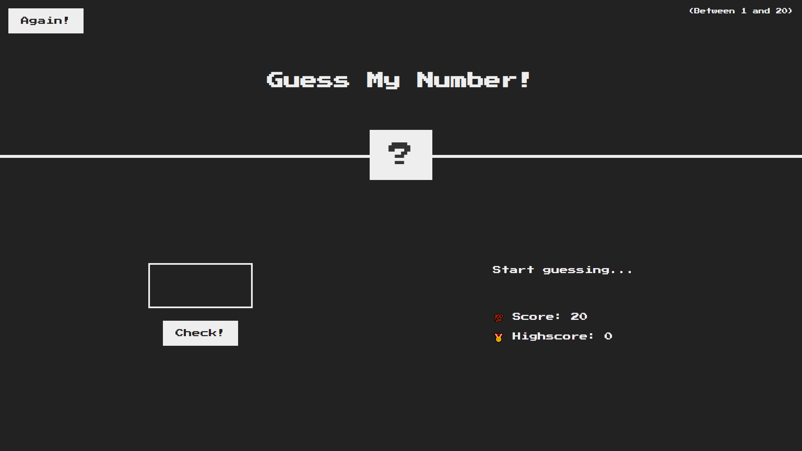
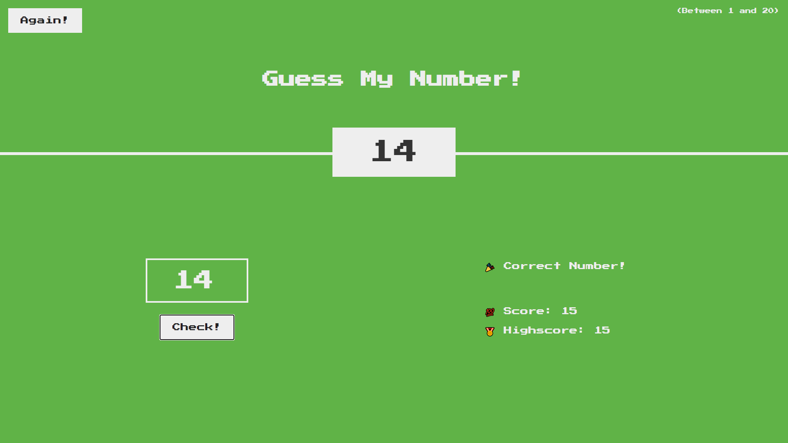

# Projetinho utilizando HTML5, CSS3 e JavaScript

O principal objetivo desse projeto era treinar manipulação envolvendo o DOM.
Para executar o programa basta abrir o arquivo index.html no seu navegador.

Caso queira acessar ele diretamente, [clique aqui.](https://try-guess-my-number.netlify.app/)

#

